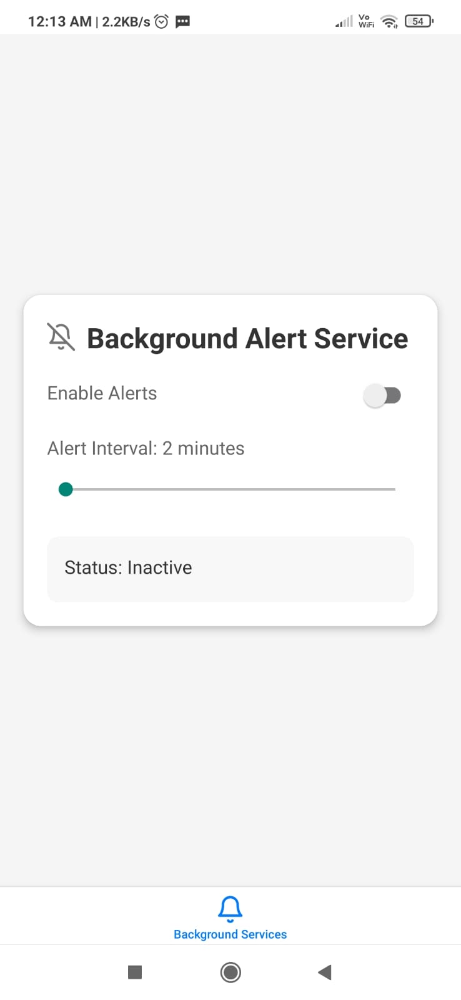
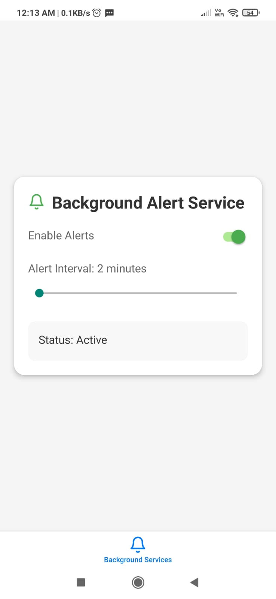
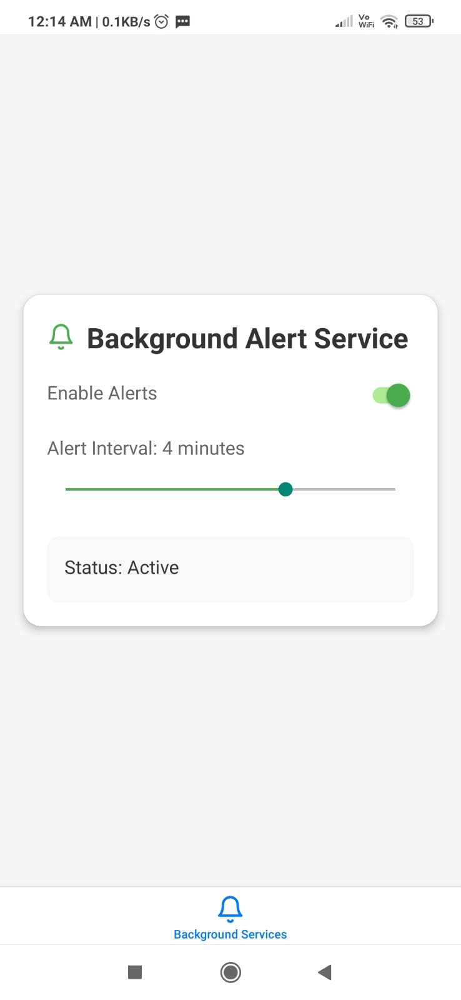

# 🔊 **Background Service Expo**

A modern Expo-based React Native application that runs background services to play sound notifications at scheduled intervals. Built with **Expo**, **TypeScript**, and **Redux Toolkit**, this app ensures state persistence and efficient background task execution.

---

## ✨ **Features**
✅ **Background Task Execution** with `expo-background-fetch` & `expo-task-manager`  
✅ **Sound Alerts** even when the app is in the background  
✅ **State Management** with **Redux Toolkit**  
✅ **Persisted Data** using **Redux Persist**  
✅ **Push Notifications** with `expo-notifications`  
✅ **Custom Icons** with `@expo/vector-icons`  
✅ **Built with TypeScript** for type safety  

---

## 🚀 **Tech Stack & Tools**
| **Technology**  | **Usage** |
|----------------|----------|
| **Expo** | React Native framework for mobile development |
| **React Native** | UI development for Android & iOS |
| **TypeScript** | Type safety and improved development experience |
| **Redux Toolkit** | State management |
| **Redux Persist** | Persisting service active status and alert time |
| **Expo Notifications** | Handling push notifications |
| **Expo Background Fetch & Task Manager** | Running tasks in the background |
| **@expo/vector-icons** | Custom icons |

---

## 📸 **App Screenshots**  

### **🔊 Background Service in Action**  
    

---

## 🛠 **Getting Started**

### **1⃣ Clone the Repository**
```sh
git clone https://github.com/Prince712/BackgroundServiceExpo.git
cd BackgroundServiceExpo
```

### **2⃣ Install Dependencies**
```sh
npm install
```

### **3⃣ Run the App**
```sh
npx expo start
```
Scan the QR code to run the app on your device using **Expo Go** or an emulator.

---

## ⚠️ **Limitations**
- 🚫 **Expo Background Fetch Limitation**: If the app is **killed or closed**, the background service **will not work**.
- ⏳ **Minimum 15-Minute Interval**: Android enforces a minimum interval of **15 minutes** for background fetch.
- ⏰ **Execution Timing is Not Guaranteed**: OS restrictions may delay task execution.

---

## 🔮 **Upcoming Enhancements**
- 🔄 **Switching to Bare Workflow** to remove the limitation where background services stop when the app is killed or closed.
- 🚀 **Implementing `react-native-background-fetch`** for improved background execution reliability.
- 🎨 **Enhancing UI/UX** with better styling and user experience improvements.

---

## 🎉 **Contributing**
1. **Fork** the repository  
2. Create a **new branch** (`feature/my-feature`)  
3. **Commit** your changes (`git commit -m "Added new feature"`)  
4. **Push** to your branch (`git push origin feature/my-feature`)  
5. Create a **Pull Request** 🚀  

---

## 🔗 **Connect with Me**
📧 Email: [prince.dabekar7@gmail.com](mailto:prince.dabekar7@gmail.com)  
📎 LinkedIn: [Pravin Dabekar](https://www.linkedin.com/in/pravin-dabekar-467b98b2/)  

---

## 📜 **License**
This project is licensed under the **MIT License**. Feel free to use, modify, and contribute! 😊

